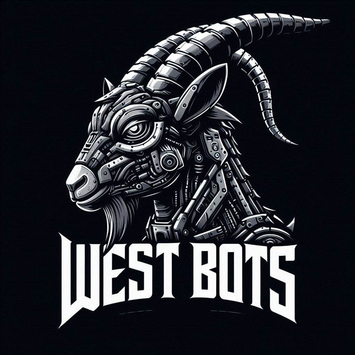
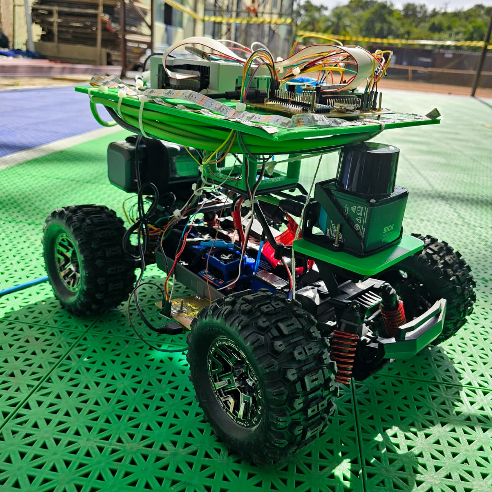
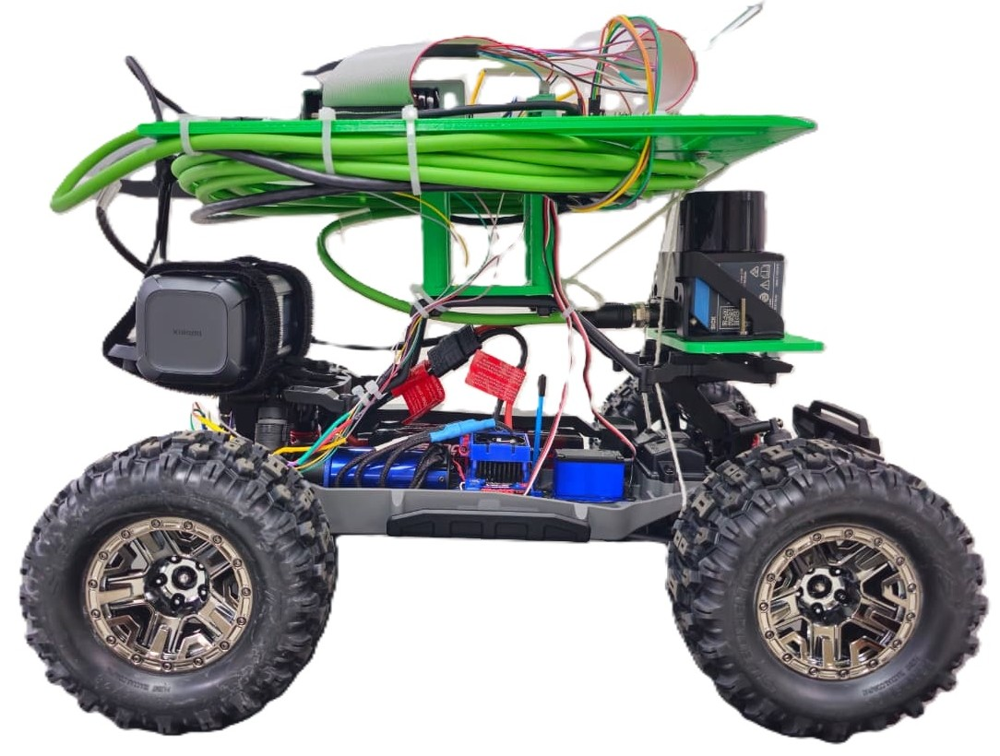
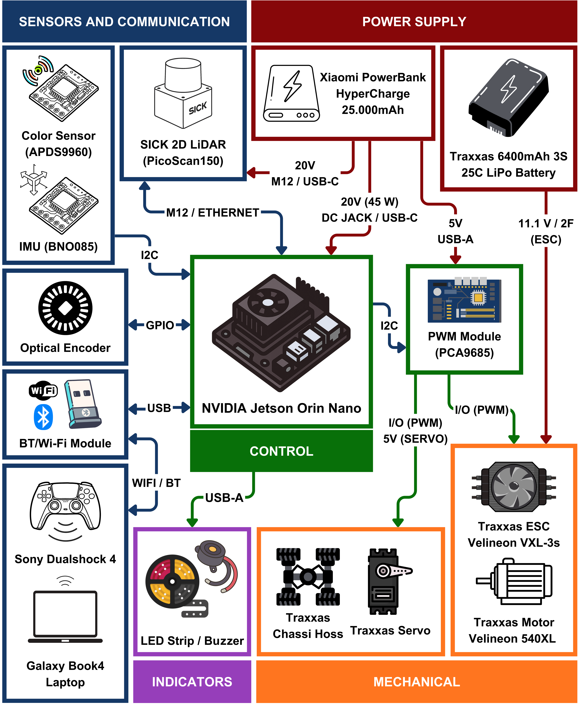
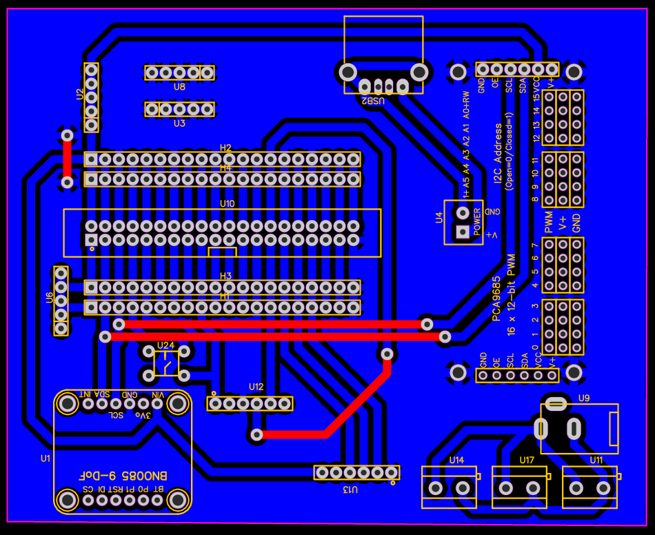
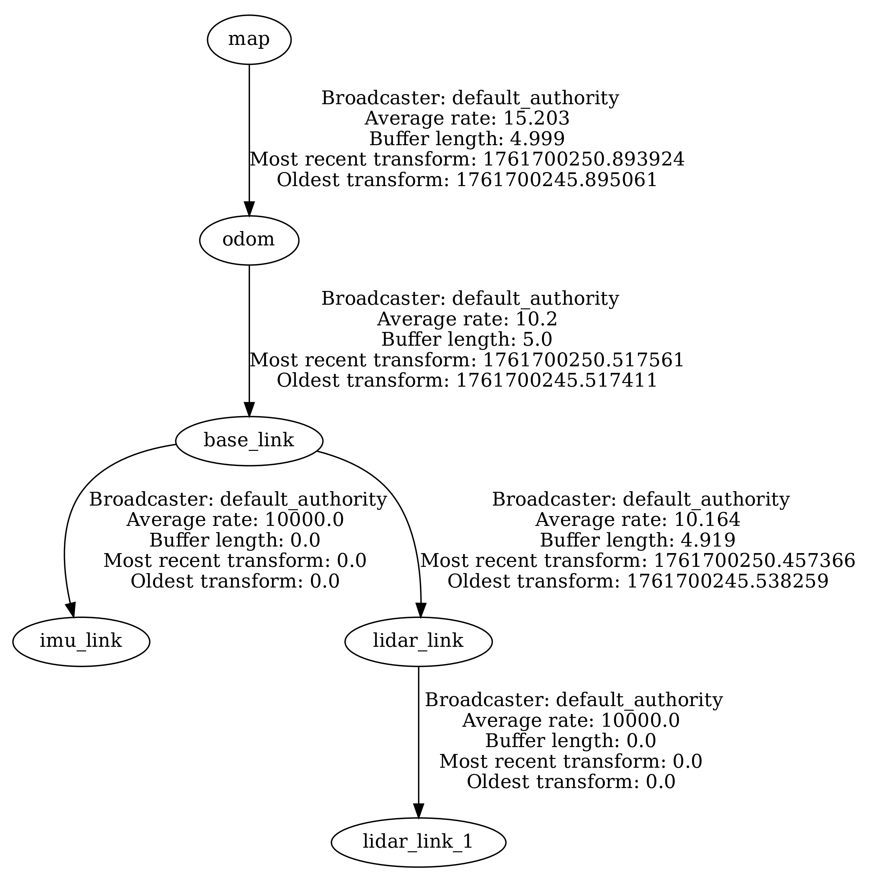
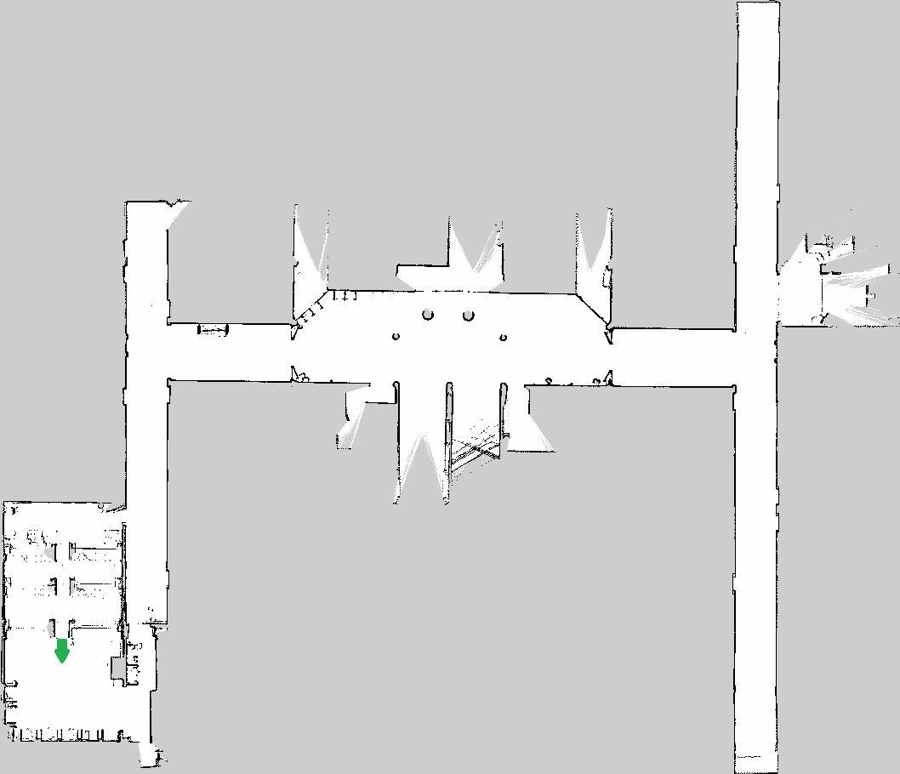

<h1 align="center">Autonomous Vehicle - TREKKING Category 🏎️</h1>
<p align="center">Real-world project of a 1/10 scale autonomous vehicle for mapping and navigation in static environments using ROS.</p>

<p align="center">
  <a href="https://docs.ros.org/en/humble/index.html">
    
  </a>
  <a href="https://releases.ubuntu.com/22.04/">
    
  </a>
  <a href="https://docs.nav2.org/">
  
  </a>
  <a href="#-contribuidores">
    
  </a>
  </p>

> **Copyright Notice**

Copyright © 2025 Carlos Leonardo Lazzari.

This repository may be used, copied, modified, and redistributed under the terms of the **Apache License 2.0**. This license does not grant rights over the trademarks, names, or logos of the project, the WEST BOTS team, or UNOESC. See the [LICENSE](./LICENSE) file for more details.

## Contact

### ⚡ Lead Author and Project Manager - **Electrical Engineer Carlos Leonardo Lazzari**

<p align="left">
  <a href="https://www.linkedin.com/in/carlos-leonardo29/">
    
  </a>
  <a href="http://lattes.cnpq.br/1607061869218351">
    
  </a>
  <a href="https://linktr.ee/carlosleonardo29">
    
  </a>
</p>

## 🤝 Contributors
  
- **Murilo Ribeiro Bonato** – [LinkedIn](https://www.linkedin.com/in/murilo-bonato-0996a3226/)  
- **Prof. Dr. Kleyton Hoffmann** – [LinkedIn](https://www.linkedin.com/in/kleyton-hoffmann/)  
- **Prof. Dr. Renato Gregolon Scortegagna** – [LinkedIn](https://www.linkedin.com/in/renato-scortegagna-99028bab/)

> ℹ️ **For usage requests or questions:** Contact via email: [carlos.leonardo290403@gmail.com](mailto:carlos.leonardo290403@gmail.com) or [kleyton.hoffmann@unoesc.edu.br](mailto:kleyton.hoffmann@unoesc.edu.br).

## 🗂️ Contents
- [🎈 Introduction](#-introduction)
- [🚀 System Initialization](#-system-initialization)
- [⚙️ Dependencies](#-dependencies)
- [📂 Package Structure](#-package-structure)
- [🧪 Compilation and Build](#-compilation-and-build)
- [🖥️ System Architecture](#-system-architecture)
  - [📦 Hardware Architecture](#-hardware-architecture)
  - [💻 Software Architecture](#-software-architecture)
- [📊 Results Obtained](#-results-obtained)
- [📚 Tutorials](#-tutorials)
- [🔗 References](#-references)
- [🔬 How to Cite](#-how-to-cite)

## 🎈 Introduction

### Project Information

This project was developed by Electrical Engineering students **Carlos Leonardo Lazzari** and **Murilo Ribeiro Bonato**, currently electrical engineers, under the guidance of Prof. Dr. Electrical Engineer **Kleyton Hoffmann**, as a Bachelor's Thesis for the Electrical Engineering course, in conjunction with the WEST BOTS team at UNOESC, Joaçaba campus, SC, Brazil (2025). All equipment and components used were funded by FAPESC, through Grant No. 51/2024, and by UNOESC.

The prototype must be capable of performing prior mapping of a static environment during the competition testing phases, under operator control. In valid stages, it must localize itself within the mapped environment, generate, and follow trajectories autonomously and sequentially to previously known points.

> ℹ️ **Thesis Title:** *Development of an Autonomous Vehicle with ROS for Mapping and Navigation in Static Environments.*

> ℹ️ **Note:** The development of this project was based on the simulation available at: <https://github.com/CarlosLeonardo29/trekking_sim>.

---

### UNOESC Robotics Team - WEST BOTS

<p align="center">
  
  &nbsp;&nbsp;&nbsp;&nbsp;
  
</p>

<p align="center">
  <em>Figure 1 — Logotypes of the WEST BOTS team and the University of the West of Santa Catarina (UNOESC).</em>
</p>

---

### Developed Autonomous Vehicle

<p align="center">
  
  &nbsp;&nbsp;
  
</p>

<p align="center">
  <em>Figure 2 — Final configuration of the autonomous vehicle developed by the WEST BOTS team.</em>
</p>

## 🚀 System Initialization

Clone the project inside a `colcon` ROS 2 workspace.  
To create a workspace, follow [this official tutorial](https://docs.ros.org/en/humble/Tutorials/Workspace/Creating-A-Workspace.html).

After cloning the project and installing dependencies, compile with:

```bash
colcon build
source install/setup.bash
```

To generate the robot frames.

```bash
ros2 launch trekking_amr robot.launch.py
```

To run the robot nodes.

```bash
ros2 run trekking_amr bno085_node

ros2 run trekking_amr odom_node
```

To run the SICK PICOSCAN150 LiDAR driver.

```bash
ros2 launch sick_scan_xd sick_picoscan.launch.py
```

To visualize data and the robot.

```bash
ros2 run rviz2 rviz2
```

To run all main robot files.

```bash
ros2 run trekking_amr exec_robot.launch.py
```

To manually control the robot (PS4 Controller).

```bash
ros2 launch trekking_amr teleop.launch.py

run cmd_vel_to_pwm.py
```

To run SLAM (mapping mode).

```bash
ros2 launch trekking_amr slam.launch.mapper.py
```

To save the generated map.

```bash
ros2 run nav2_map_server map_saver_cli -f ~/dev_ws/src/trekking_amr/maps/mapa_trekking
```

```bash
ros2 service call /slam_toolbox/serialize_map slam_toolbox/srv/SerializePoseGraph "{filename: '/home/carloslazzari/dev_ws/src/trekking_amr/maps/mapa_trekking'}"
```

> 💬 **Note:** The commands above will generate the following files in the specified directory:
>
> - `mapa_trekking.pgm`: occupancy grid image.
> - `mapa_trekking.yaml`: map metadata file.
> - `mapa_trekking.data`: serialized map data (used internally by SLAM Toolbox).
> - `mapa_trekking.posegraph`: serialized pose graph (used for localization and map merging).

To run SLAM (localization mode - using a previously generated map).

```bash
ros2 launch trekking_amr slam.launch.localization.py
```

To activate the robot's autonomous navigation mode (NAV2).

```bash
ros2 launch trekking_amr navigation_launch.py use_sim_time:=false
```

To save the route generated by NAV2.

```bash
ros2 run trekking_amr nav_plan_node
```

To save the route performed by the robot.

```bash
ros2 run trekking_amr odom_path_node
```

## ⚙️ Dependencies

Dependencies required for the package in ROS 2.

```bash
sudo apt install ros-humble-ros-gz-sim ros-humble-joy ros-humble-teleop-twist-joy ros-humble-robot-localization ros-humble-slam-toolbox ros-humble-ros-gz-bridge ros-humble-nav2-bringup ros-humble-navigation2 ros-humble-xacro ros-humble-joint-state-publisher* ros-humble-rqt* ros-humble-sick-scan-xd 
```

Other dependencies required for the package.

```bash
sudo apt install python3-pip
sudo pip3 install adafruit-circuitpython-bno08x adafruit-circuitpython-pca9685 Jetson.GPIO
```

### Environment Configuration

To configure the development environment, add the following lines to the `~/.bashrc` file.

```bash
source /opt/ros/humble/setup.bash
source ~/dev_ws/install/setup.bash
export ROS_DOMAIN_ID=0
export ROS_LOCALHOST_ONLY=1
export LIBGL_ALWAYS_SOFTWARE=0 
```

### CYCLONEDDS Configuration

```bash
export RMW_IMPLEMENTATION=rmw_cyclonedds_cpp
export CYCLONEDDS_URI=file:///home/carloslazzari/dev_ws/src/trekking_amr/config/dds_configuration.xml
```

## 📂 Package Structure

Description of the contents of each directory in the **trekking_amr** package.

| Folder | Description |
|---|---|
| [**config/**](./config) | Node configuration files and system parameters. |
| [**launch/**](./launch) | Files for initializing components in ROS 2. |
| [**urdf/**](./urdf) | Robot description in URDF/Xacro. |
| [**meshes/**](./meshes) | 3D models of the robot. |
| [**sensors/**](./sensors) | Configurations and definitions of embedded sensors. |
| [**rviz/**](./rviz) | Visualization configurations in RViz. |
| [**maps/**](./maps) | Maps generated and used by the system. |
| [**scripts/**](./scripts) | Auxiliary Python scripts. |
| [**extras/**](./extras) | Complementary project files. |
| [**images/**](./images) | Images used in the documentation. |

## 🧪 Compilation and Build

> ⚠️ Attention: all directories must be listed in the `setup.py` file for the build to work.

```bash
(os.path.join("share", package_name, "launch"), glob("launch/*")),
(os.path.join("share", package_name, "rviz"), glob("rviz/*")),
(os.path.join("share", package_name, "config"), glob("config/*")),
(os.path.join("share", package_name, "scripts"), glob("scripts/*")),
(os.path.join("share", package_name, "sensors"), glob("sensors/*")),
(os.path.join("share", package_name, "meshes"), glob("meshes/*")),
(os.path.join("share", package_name, "urdf"), glob("urdf/*")),
```

```bash
entry_points={
    "console_scripts": [
        'bno085_node = sensors.bno085_node:main',
        'odom_node = sensors.odom_node:main',
        'odom_path_node = sensors.odom_path_node:main',
        'nav_plan_node = sensors.nav_plan_node:main',
    ],
```

**IMPORTANT**: If you make any changes to the files in this project, you must run the build and source commands again!

## 🖥️ System Architecture

### 📦 Hardware Architecture

Figure **3** presents the block diagram of the hardware architecture of the developed prototype.

<p align="center">
  
</p>

<p align="center">
  <em>Figure 3 — Block diagram of the system hardware architecture.</em>
</p>

---

Figure **4** presents the PCB design for the NVIDIA Jetson Orin Nano pin extension.

<p align="center">
  
</p>

<p align="center">
  <em>Figure 4 — Extension board for NVIDIA Jetson Orin Nano.</em>
</p>

---

### 💻 Software Architecture

#### 🛠️ Operational Flowchart

Figures **5** and **6** present the operational flowcharts of the developed prototype.

<p align="center">
  
  
</p>

<p align="center">
  <em>Figure 5 — Flowcharts for mode selection and manual mode of the prototype.</em>
</p>

<p align="center">
  
</p>

<p align="center">
  <em>Figure 6 — Flowchart of the prototype's autonomous mode.</em>
</p>

---

#### 🛠️ Transform Tree (TF Tree)

Figure **7** presents the robot's frame hierarchy, indicating how each position and orientation reference (*pose*) is connected to the coordinate system. Below, you can view the transform tree of the developed project.

<p align="center">
  
</p>

<p align="center">
  <em>Figure 7 — Transform tree (TF Tree) of the system.</em>
</p>

## 📊 Results Obtained

Figure **8** presents the map of the environment constructed using the **SLAM Toolbox** tool in manual control mode. The map represents obstacles, walls, navigable areas — such as corridors and laboratories — and non-navigable areas, including ramps, sections without flooring, and rooms inaccessible during testing.

<p align="center">
  
</p>

<p align="center">
  <em>Figure 8 — Map of the environment generated with the SLAM Toolbox tool.</em>
</p>

---

Figure **9** presents the trajectory effectively traversed by the robot in autonomous mode, recorded from accumulated odometry data and pose estimation, considering an environment previously delimited for experimental tests.

<p align="center">
  
</p>

<p align="center">
  <em>Figure 9 — Route performed by the robot in autonomous mode during tests.</em>
</p>

## 📚 Tutorials

To execute this project, you must have **ROS 2 Humble** and **Gazebo Sim** installed on your system.

- [Install ROS 2 Humble (Ubuntu)](https://docs.ros.org/en/humble/Installation/Ubuntu-Install-Debians.html)
- [Install Gazebo Sim (integration with ROS)](https://gazebosim.org/docs/latest/ros_installation/)

## 🔗 References

- [ROS 2 Documentation](https://docs.ros.org/en/humble/)
- [Ignition Gazebo Documentation](https://gazebosim.org/docs)
- [Nav2 Tutorials](https://docs.nav2.org/)
- [SLAM Toolbox](https://docs.nav2.org/tutorials/docs/navigation2_with_slam.html)

## 🔬 How to Cite

If this project or repository is used in academic or technical work, the following citation is requested:

**Reference (ABNT):**

LAZZARI, Carlos Leonardo; BONATO, Murilo Ribeiro. **Desenvolvimento de um Veículo Autônomo com ROS para Mapeamento e Navegação em Ambientes Estáticos.** Orientador: Prof. Dr. Kleyton Hoffmann. Trabalho de Conclusão de Curso (Bacharelado em Engenharia Elétrica) – Universidade do Oeste de Santa Catarina, Joaçaba, 2025.

**BibTeX:**

```bibtex
@thesis{Lazzari2025,
  author  = {Lazzari, Carlos Leonardo and Bonato, Murilo Ribeiro},
  title   = {Desenvolvimento de um Veículo Autônomo com ROS para Mapeamento e Navegação em Ambientes Estáticos},
  school  = {Universidade do Oeste de Santa Catarina - UNOESC},
  address = {Joaçaba, SC, Brasil},
  year    = {2025},
  type    = {Trabalho de Conclusão de Curso (Engenharia Elétrica)},
  note    = {Orientador: Prof. Dr. Kleyton Hoffmann}
}
```